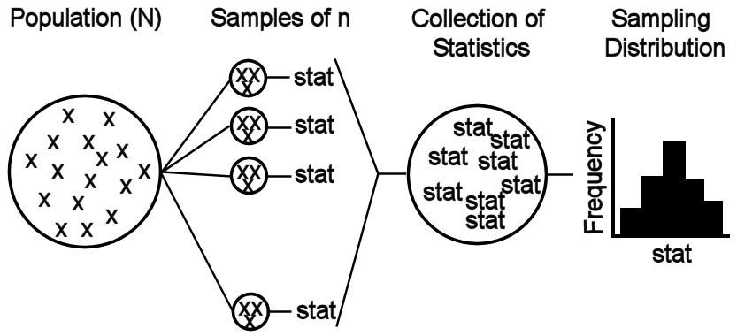

# Sampling Distributions {#SamplingDist}
Statistical inference is the process of making a conclusion about the parameter of a population based on the statistic computed from a sample. This process is difficult becauses statistics depend on the specific individuals in the sample and, thus, vary from sample to sample. For example, recall from Section \@ref(performing-an-ivppss) that the mean length of fish differed among four samples "taken" from Square Lake. Thus, to make conclusions about the population from the sample, the distribution (i.e., shape, center, and dispersion) of the statistic computed from all possible samples must be understood.^[See Module \@ref(WhyStats) for a review of sampling variability.] In this module, the distribution of statistics from all possible samples is explored and generalizations are defined that can be used to make inferences. In subsequent modules, this information, along with results from a single sample, will be used to make specific inferences about the population.

::: {.tip data-latex=''}
Statistical inference requires considering sampling variability.
:::

## What is a Sampling Distribution?
### Definitions and Characteristics
A **Sampling distribution** is the distribution of values of a particular statistic computed from all possible samples of the same size from the same population. The discussion of sampling distributions and all subsequent theories related to statistical inference are based on repeated samples from the same population. As these theories are developed, we will consider taking multiple samples; however, after the theories have been developed, then only one sample will be taken with the theory then being applied to those results. Thus, it is important to note that only one sample is ever actually taken from a population.

```{r echo=FALSE}
scores <- c(6,6,4,5,7,8)
mu <- mean(scores)
sigma <- sd(scores)
```

The concept of a sampling distribution is illustrated with a population of six students that scored `r paste(scores[1:5],collapse=", ")` and `r scores[6]` points, respectively, on an 8-point quiz. The mean of this population is &mu;= `r formatC(mu,format="f",digits=3)` points and the standard deviation is &sigma;=`r formatC(sigma,format="f",digits=3)` points. Suppose that every sample of size n=2 is extracted from this population and that the sample mean is computed for each sample (Table \@ref(tab:SDistQuiz2)).^[These samples are found by putting the values into a vector with `vals <- c(6,6,4,5,7,8)` and then using `combn(vals,2)`. The means are found with `mns <- as.numeric(combn(vals,2,mean))`.] The sampling distribution of the sample mean from samples of n=2 from this population (Figure \@ref(fig:SDistQuizHist2)) is the histogram of means from these 15 samples.^[The histogram is constructed with `hist(~mns,w=0.5)`.]

&nbsp;

```{r SDistQuiz2, echo=FALSE}
tmp <- combn(scores,2)
tmp <- data.frame(Sample=1:ncol(tmp),
                  Scores=paste(tmp[1,],tmp[2,],sep=", "),
                  Mean=combn(scores,2,mean))
tmp %>%
  knitr::kable(booktab=TRUE,row.names=FALSE,align="c",caption="All possible samples of $n=2$ and corresponding sample mean from the quiz score population.") %>%
  kableExtra::kable_classic("hover",full_width=FALSE,html_font=khfont) %>%
  kableExtra::row_spec(0,bold=TRUE) %>%
  kableExtra::column_spec(1:3,width="0.9in") %>%
  kableExtra::column_spec(1,bold=TRUE)
```

&nbsp;

```{r SDistQuizHist2, echo=FALSE, fig.cap="Sampling distribution of mean quiz scores from samples of $n=2$ from the quiz score population."}
par(mar=c(3.05,3.05,0.5,0.5),mgp=c(1.9,0.5,0),tcl=-0.2)
mns2 <- as.numeric(combn(scores,2,mean))
mnmns2 <- mean(mns2)
semns2 <- sd(mns2)
hist(~mns2,xlab="Sample Mean",ylab="Frequency of Samples",w=0.5,xlim=c(4.5,8))
```

&nbsp;

The mean (=`r formatC(mnmns2,format="f",digits=3)`) and standard deviation (=`r formatC(semns2,format="f",digits=3)`) of the 15 sample means are measures of center and dispersion for the sampling distribution. The standard deviation of statistics (i.e., dispersion of the sampling distribution) is generally referred to as the **standard error of the statistic** (abbreviated as $SE_{stat}$). This new terminology is used to keep the dispersion of the sampling distribution separate from the dispersion of individuals in the population, which is measured by the standard deviation. Thus, the standard deviation of all possible sample means is referred to as the standard error of the sample means (SE). The SE in this example is `r formatC(semns2,format="f",digits=3)`. The standard deviation is the dispersion of individuals in the population and, in this example, is `r formatC(sigma,format="f",digits=3)`.

This example illustrates three major concepts concerning sampling distributions. First, the sampling distribution will more closely resemble a normal distribution than the original population distribution (unless, of course, the population distribution was normal).

Second, the center (i.e., mean) of the sampling distribution will equal the parameter that the statistic was intended to estimate (e.g., a sample mean is intended to be an estimate of the population mean). In this example, the mean of all possible sample means (= `r formatC(mnmns2,format="f",digits=1)` points) is equal to the mean of the original population (&mu;=`r formatC(mu,format="f",digits=1)` points). A statistic is said to be **unbiased** if the center (mean) of its sampling distribution equals the parameter it was intended to estimate. This example illustrates that the sample mean is an unbiased estimate of the population mean.

Third, the standard error of the statistic is less than the standard deviation of the original population. In other words, the dispersion of statistics is less than the dispersion of individuals in the population. For example, the dispersion of individuals in the population is &sigma;=`r formatC(sigma,format="f",digits=3)` points, whereas the dispersion of statistics from all possible samples is $SE_{\bar{\text{x}}}=$ `r formatC(semns2,format="f",digits=3)` points.

::: {.tip data-latex=''}
All statistics in this course are unbiased.
:::

### Critical Distinction
Three distributions are considered in statistics. The sampling distribution is the distribution of a statistic computed from all possible samples of the same size from the same population, the population distribution is the distribution of all individuals in a population (see Module \@ref(NormalDist1)), and the sample distribution is the distribution of all individuals in a sample (see histograms in Module \@ref(UnivSum)). The sampling distribution is about **statistics**, whereas the population and sample distributions are about **individuals**. For inferential statistics, it is important to distinguish between population and sampling distributions. Keep in mind that one (population) is the distribution of individuals and the other (sampling) is the distribution of statistics.

Just as importantly, remember that a standard error measures the dispersion among statistics (i.e., sampling variability), whereas a standard deviation measures dispersion among individuals (i.e., natural variability). Specifically, the population standard deviation measures dispersion among all individuals in the population and the sample standard deviation measures dispersion of all individuals in a sample. In contrast, the standard error measures dispersion among statistics computed from all possible samples. The population standard deviation is the dispersion on a population distribution, whereas the standard error is the dispersion on a sampling distribution.

### Dependencies
```{r echo=FALSE, results='hide'}
mns3 <- as.numeric(combn(scores,3,mean))
mnmns3 <- mean(mns3)
semns3 <- sd(mns3)

mdn3 <- as.numeric(combn(scores,3,median))
mnmdn3 <- mean(mdn3)
semdn3 <- sd(mdn3)
```

The sampling distribution of sample means from samples of $n=2$ from the population of quizzes was shown above. The sampling distribution will look different if any other sample size is used. For example, the samples and means from each sample of $n=3$ are shown in Table \@ref(tab:SDistQuiz3). The mean of these means is `r formatC(mnmns3,format="f",digits=3)`, the standard error is `r formatC(semns3,format="f",digits=3)`, and the sampling distribution is symmetric, perhaps approximately normal (Figure \@ref(fig:SDistQuizHist3)). The three major characteristics of sampling distributions noted in Section \@ref(definitions-and-characteristics) are still true: the sampling distribution is still more normal than the original population, the sample mean is still unbiased (i.e, the mean of the means is equal to &mu;), and the standard error is smaller than the standard deviation of the original population. However, also take note that the standard error of the sample mean is smaller from samples of $n=3$ than from $n=2$.^[One should also look at the results from $n=4$ in one of the online Review Exercises.]

&nbsp;

```{r SDistQuiz3, echo=FALSE}
tmp <- combn(scores,3)
tmp <- data.frame(Sample=1:ncol(tmp),
                  Scores=paste(tmp[1,],tmp[2,],tmp[3,],sep=", "),
                  Mean=combn(scores,3,mean))
tmp %>%
  knitr::kable(booktab=TRUE,row.names=FALSE,align="c",digits=c(0,0,3),caption="All possible samples of $n=3$ and corresponding sample mean from the quiz score population.") %>%
  kableExtra::kable_classic("hover",full_width=FALSE,html_font=khfont) %>%
  kableExtra::row_spec(0,bold=TRUE) %>%
  kableExtra::column_spec(1:3,width="0.9in") %>%
  kableExtra::column_spec(1,bold=TRUE)
```

&nbsp;

```{r SDistQuizHist3, echo=FALSE, fig.cap="Sampling distribution of mean quiz scores from samples of $n=3$ from the quiz score population."}
par(mar=c(3.05,3.05,0.5,0.5),mgp=c(1.9,0.5,0),tcl=-0.2)
hist(~mns3,xlab="Sample Mean",ylab="Frequency of Samples",w=1/3,xlim=c(5,7.5))
```

&nbsp;

The sampling distribution will also be different if the statistic changes; e.g, if the sample median rather than sample mean is computed in each sample. Before showing the results of each sample, note that the population median (i.e., the median of the individuals in the population --- 6, 6, 4, 5, 7, and 8) is `r formatC(median(scores),format="f",digits=1)` points. The sample median from each sample is shown in Table \@ref(tab:SDistQuizMdns3) and the actual sampling distribution is shown in Figure \@ref(fig:SDistQuizMdnsHist3). Note that the sampling distribution of the sample medians is still "more" normal than the original population distribution, the mean of the sample medians (=`r formatC(mnmdn3,format="f",digits=3)` points) still equals the parameter (population median) that the sample median is intended to estimate (thus the sample median is also unbiased), and this sampling distribution differs from the sampling distribution of sample means from samples of $n=3$.

&nbsp;

```{r SDistQuizMdns3, echo=FALSE}
tmp <- combn(scores,3)
tmp <- data.frame(Sample=1:ncol(tmp),
                  Scores=paste(tmp[1,],tmp[2,],tmp[3,],sep=", "),
                  Mean=combn(scores,3,median))
tmp %>%
  knitr::kable(booktab=TRUE,row.names=FALSE,align="c",caption="All possible samples of $n=3$ and corresponding sample medians from the quiz score population.") %>%
  kableExtra::kable_classic("hover",full_width=FALSE,html_font=khfont) %>%
  kableExtra::row_spec(0,bold=TRUE) %>%
  kableExtra::column_spec(1:3,width="0.9in") %>%
  kableExtra::column_spec(1,bold=TRUE)
```

&nbsp;

```{r SDistQuizMdnsHist3, echo=FALSE, fig.cap="Sampling distribution of median quiz scores from $n=3$ samples from the quiz score population."}
par(mar=c(3.05,3.05,0.5,0.5),mgp=c(1.9,0.5,0),tcl=-0.2)
hist(~mdn3,ylab="Frequency of Samples",xlab="Sample Median",w=1,xlim=c(5,8))
```

&nbsp;

These examples demonstrate that the naming of a sampling distribution must be specific. For example, the first sampling distribution in this module should be described as the "sampling distribution of sample means from samples of n=2."  This last example should be described as the "sampling distribution of sample medians from samples of n=3."  Doing this with each distribution reinforces the point that sampling distributions depend on the sample size and the statistic calculated.

::: {.tip data-latex=''}
Each sampling distribution should be specifically labeled with the statistic calculated and the sample size of the samples.
:::


### Simulating a Sampling Distribution
Exact sampling distributions can only be computed for very small samples taken from a small population. Exact sampling distributions are difficult to show for even moderate sample sizes from moderately-sized populations. For example, there are `r formatC(choose(20,5),format="f",digits=0)` unique samples of $n=5$ from a population of 20 individuals. How are sampling distributions examined in these and even larger situations?

There are two ways to examine sampling distributions in situations with large sample and population sizes. First, theorems exist that describe the specifics of sampling distributions under certain conditions. One such theorem is described in Section \@ref(central-limit-theorem). Second, the computer can take many (hundreds or thousands) samples and compute the statistic for each. These statistics can then be summarized to give an indication of what the actual sampling distribution would look like. This process is called "simulating a sampling distribution." We will simulate some sampling distributions here so that the theorem will be easier to understand.

Sampling distributions are simulated by drawing many samples from a population, computing the statistic of interest for each sample, and constructing a histogram of those statistics (Figure \@ref(fig:SamplingDistributionScheme)). The computer is helpful with this simulation; however, keep in mind that the computer is basically following the same process as used in Section \@ref(definitions-and-characteristics), with the exception that not every sample is taken.

&nbsp;

```{r SamplingDistributionScheme, echo=FALSE, fig.cap="Schematic representation of the process for simulating a sampling distribution.", fig.align="center", out.width="90%"}

```

&nbsp;

Let's return to the Square Lake fish population from Section \@ref(performing-an-ivppss) to illustrate simulating a sampling distribution. Recall that this is a hypothetical population with 1015 fish, a population distribution shown in Figure \@ref(fig:SquareLakePopn), and parameters shown in Table \@ref(tab:SquareLakePopnTbl). Further recall that four samples of $n=50$ were removed from this population and summarized in Table \@ref(tab:SquareLakeSample1s) and Table \@ref(tab:SquareLakeSample234s). Suppose, that an additional 996 samples of $n=50$ were extracted in exactly the same way as the first four, the sample mean was computed in each sample, and the 1000 sample means were collected to form the histogram in Figure \@ref(fig:SampDistSLMean50). This histogram is a simulated sampling distribution of sample means because it represents the distribution of sample means from 1000, rather than all possible, samples.

&nbsp;

```{r SampDistSLMean50, echo=FALSE, fig.cap="Histogram (**Left**) and summary statistics (**Right**) from 1000 sample mean total lengths computed from samples of $n=50$ from the Square Lake fish population.",fig.show="hold"}
par(mar=c(3.05,3.05,0.5,0.5),mgp=c(1.9,0.5,0),tcl=-0.2)
data(SquareLakePopn)
set.seed(10)
resamples <- 1000
res.avg50 <- replicate(resamples,mean(sample(SquareLakePopn$tl,50)))
hist(~res.avg50,ylab="Frequency of Samples",xlab="Sample Mean")
sums.avg50 <- as.matrix(Summarize(res.avg50)[2:8])
colnames(sums.avg50)[1] <- "Means"
gplots::textplot(round(sums.avg50,2),cex=1)
```

&nbsp;

As with the actual sampling distributions discussed previously, three characteristics (shape, center, and dispersion) are examined with simulated sampling distributions. First, Figure \@ref(fig:SampDistSLMean50) looks at least approximately normally distributed. Second, the mean of the 1000 means (=`r formatC(sums.avg50["mean",],format="f",digits=2)`) is approximately equal to the mean of the original 1015 fish in Square Lake (=`r formatC(mean(SquareLakePopn$tl),format="f",digits=2)`). These two values are not exactly the same because the simulated sampling distribution was constructed from only a "few" rather than all possible samples. Third, the standard error of the sample means (=`r formatC(sums.avg50["sd",],format="f",digits=2)`) is much less than the standard deviation of individuals in the original population (=`r formatC(sd(SquareLakePopn$tl),format="f",digits=2)`). So, within reasonable approximation, the concepts identified with actual sampling distributions also appear to hold for simulated sampling distributions.

As before, computing a different statistic on each sample results in a different sampling distribution. This is illustrated by comparing the sampling distributions of a variety of statistics from the same 1000 samples of size n=50 taken above (Figure \@ref(fig:SampDistSLOther50)).

&nbsp;

```{r SampDistSLOther50, echo=FALSE, fig.width=7.5, fig.height=5.25, fig.cap="Histograms from 1000 sample median (**Left**), standard deviation (**Center**), and range (**Right**) of total lengths computed from samples of $n=50$ from the Square Lake fish population. Note that the value in the parameter row is the value computed from the entire population."}
par(mar=c(3.05,3.05,0.5,0.5),mgp=c(1.9,0.5,0),tcl=-0.2)
layout(matrix(c(1,2,3,4,5,6),2,3,byrow=F),c(1,1,1),c(2,1))
set.seed(10)
hist.cex <- 1.4
text.cex <- 1.4
resamples <- 1000
res.mdn50 <- replicate(resamples,median(sample(SquareLakePopn$tl,50)))
res.sd50 <- replicate(resamples,sd(sample(SquareLakePopn$tl,50)))
res.rng50 <- replicate(resamples,range(sample(SquareLakePopn$tl,50)))
res.rng50 <- res.rng50[2,]-res.rng50[1,]
hist(~res.mdn50,ylab="Frequency of Samples",xlab="Sample Median",cex.lab=hist.cex,xaxs="i")
sums.mdn50 <- as.matrix(c(Summarize(res.mdn50)[c("mean","sd","min","max")],median(SquareLakePopn$tl)))
colnames(sums.mdn50)[1] <- "Medians"
rownames(sums.mdn50)[5] <- "Parameter"
gplots::textplot(round(sums.mdn50,2),cex=text.cex)
hist(~res.sd50,ylab="Frequency of Samples",xlab="Sample Standard Deviation",cex.lab=hist.cex)
sums.sd50 <- as.matrix(c(Summarize(res.sd50)[c("mean","sd","min","max")],sd(SquareLakePopn$tl)))
colnames(sums.sd50)[1] <- "Std. Devs"
rownames(sums.sd50)[5] <- "Parameter"
gplots::textplot(round(sums.sd50,2),cex=text.cex)
hist(~res.rng50,ylab="Frequency of Samples",xlab="Sample Range",cex.lab=hist.cex)
pop.rng <- range(SquareLakePopn$tl)
sums.rng50 <- as.matrix(c(Summarize(res.rng50)[c("mean","sd","min","max")],pop.rng[2]-pop.rng[1]))
colnames(sums.rng50)[1] <- "Ranges"
rownames(sums.rng50)[5] <- "Parameter"
gplots::textplot(round(sums.rng50,2),cex=text.cex)
```

&nbsp;

Simulating a sampling distribution by taking many samples of the same size from a population is powerful for two reasons. First, it reinforces the ideas of sampling variability -- i.e., each sample results in a slightly different statistic. Second, the entire concept of inferential statistics is based on theoretical sampling distributions. Simulating sampling distributions will allow us to check this theory and better visualize the theoretical concepts. From this module forward, though, remember that sampling distributions are simulated primarily as a check of theoretical concepts. In real-life, only one sample is taken from the population and the theory is used to identify the specifics of the sampling distribution.

::: {.tip data-latex=''}
Simulating sampling distributions is a tool for checking the theory concerning sampling distributions; however, in "real-life" only one sample from the population is needed.
:::

## Central Limit Theorem
The sampling distribution of the sample mean was examined in the previous sections by taking all possible samples from a small population (Section \@ref(definitions-and-characteristics)) or taking a large number of samples from a large population (Section \@ref(simulating-a-sampling-distribution)). In both instances, it was observed that the sampling distribution *of the sample mean* was approximately normally distributed, centered on the true mean of the population, and had a standard error that was smaller than the standard deviation of the population and decreased as n increased. In this section, the Central Limit Theorem (CLT) is introduced and explored as a method to identify the specific characteristics of the sampling distribution of the sample mean without going through the process of extracting multiple samples from the population.

The CLT specifically addresses the shape, center, and dispersion of the sampling distribution of the sample means by stating that $\bar{\text{x}}\sim N\left(\mu,\frac{\sigma}{\sqrt{n}}\right)$ as long as

1. n&geq;30,
1. n&geq;15 and the population distribution is not strongly skewed, **or**
1. the population distribution is normally distributed.

Thus, the sampling distribution of $\bar{\text{x}}$ should be normally distributed **no matter what the shape of the population distribution is** as long as n&geq;30. The CLT also suggests that $\bar{\text{x}}$ is unbiased and that the formula for the $SE_{\bar{\text{x}}}$ is $\frac{\sigma}{\sqrt{n}}$ regardless of the size of n. In other words, n impacts the shape of the sampling distribution of the sample means, but not the center or formula for computing the standard error.

The validity of the CLT can be examined by simulating several (with different n) sampling distributions of $\bar{\text{x}}$ from the Square Lake population and from a strongly right-skewed exponential distribution (Figure \@ref(fig:SampDistCLT)). Several observations about the CLT can be made from Figure \@ref(fig:SampDistCLT). First, the sampling distribution is approximately normal for n&geq;30 for both scenarios and is approximately normal for smaller n for the Square Lake example because that population is only slightly skewed. Second, the means of all sampling distributions in both examples are approximately equal to &mu;, regardless of n. Third, the dispersion of the sampling distributions (i.e., the SE of the means) becomes smaller with increasing n. Furthermore, the SE from the simulated results closely match the SE expected from the CLT.

&nbsp;

```{r SampDistCLT, echo=FALSE, fig.width=7.5, fig.height=9, fig.cap="Sampling distribution of the sample mean simulated from 5000 samples of four different sample sizes extracted from the Square Lake fish population (Left) and an exponential population (Right). The shapes of the populations are shown in the top histogram. On each simulated sampling distribution, the vertical blue line is the mean of the 5000 means and the horizontal red line represents &plusmn;1SE from the mean."}
resamples <- 5000
ns <- c(5,15,30,60)

# Setup layout
m <- matrix(c(1,8:12,2,13:17,0,3:7),ncol=3)
layout(m,height=c(0.15,1,0.9,0.9,0.9,0.9,1),width=c(1.5,1.5,0.15),respect=TRUE)

# Add text labels
par(mar=c(0,0,0,0))
cex.lbl <- 1.45
cex.eo <- 0.99
plot.new(); text(0.5,0.5,"Square Lake",cex=cex.lbl)
plot.new(); text(0.5,0.5,"Exponential",cex=cex.lbl)
plot.new(); text(0.75,0.7,"Population",srt=270,cex=cex.lbl)
for (i in ns) { plot.new(); text(0.75,0.7,paste("n =",i),srt=270,cex=cex.lbl) }

## Add Square Lake results
clr <- col2rgbt("orange",0.25)
# add population
par(mar=c(3,0.1,0.5,3),mgp=c(1.6,0.4,0),tcl=-0.2,yaxt="n")
hist(~tl,data=SquareLakePopn,xlab="Total Length",ylab="",w=5,col=clr)
sigma <- sd(SquareLakePopn$tl)
mu <- mean(SquareLakePopn$tl)
text(170,70,paste("mean=",formatC(mu,format="f",digits=2),
                  "\nSD=",formatC(sigma,format="f",digits=2)),cex=cex.eo)

# add sampling distributions
set.seed(10)
res.avg <- matrix(0,nrow=resamples,ncol=length(ns))
for (i in 1:length(ns)) {
  res.avg[,i] <- replicate(resamples,mean(sample(SquareLakePopn$tl,ns[i])))
}

xlmt <- c(60,140)
ylmt <- c(0,2000)  # make graph then come back and change this
for (i in 1:length(ns)) {
  if (i < length(ns)) {
    xlbl <- ""
    par(mar=c(2.5,0.1,0.5,3))
  } else {
    xlbl <- "Sample Mean"
    par(mar=c(3,0.1,0.5,3))
  }
  hist(~res.avg[,i],ylab="",xlab=xlbl,ylim=ylmt,xlim=xlmt,w=4,col=clr)
  mn <- mean(res.avg[,i])
  s <- sd(res.avg[,i])
  lines(c(mn,mn),c(0,0.95*ylmt[2]),lwd=2,col="blue")
  lines(c(mn-s,mn+s),rep(0.1*ylmt[2],2),lwd=2,col="red")
  text(xlmt[1],0.7*ylmt[2],
       paste("Expected\nmean=",formatC(mu,format="f",digits=2),
             "\nSE=",formatC(sigma/sqrt(ns[i]),format="f",digits=2)),
       pos=4,cex=cex.eo)
  text(xlmt[1]+(xlmt[2]-xlmt[1])/1.7,0.7*ylmt[2],
       paste("Observed\nmean=",formatC(mn,format="f",digits=2),
             "\nSE=",formatC(s,format="f",digits=2)),
       pos=4,cex=cex.eo)
}

## Add Exponential
clr <- col2rgbt("green3",0.15)
# add population
par(mar=c(3,3,0.5,0.1),mgp=c(1.6,0.4,0),tcl=-0.2,yaxt="n")
exppop <- rexp(5000)
hist(~exppop,xlab="Variable",ylab="",w=0.25,xlim=c(0,5),col=clr)
mu <- 1
sigma <- sqrt(1)
text(3.5,900,paste("mean=",formatC(mu,format="f",digits=2),
                  "\nSD=",formatC(sigma,format="f",digits=2)),cex=cex.eo)

# add sampling distributions
res.avg <- matrix(0,nrow=resamples,ncol=length(ns))
for (i in 1:length(ns)) {
  res.avg[,i] <- replicate(resamples,mean(sample(exppop,ns[i])))
}

ylmt <- c(0,1700)  # make graph then come back and change this
xlmt <- c(0,2.5)
for (i in 1:length(ns)) {
  if (i < length(ns)) {
    xlbl <- ""
    par(mar=c(2.5,3,0.5,0.1))
  } else {
    xlbl <- "Sample Mean"
    par(mar=c(3,3,0.5,0.1))
  }
  hist(~res.avg[,i],ylab="",xlab=xlbl,ylim=ylmt,xlim=xlmt,w=0.1,xaxt="n",col=clr)
  axis(1,seq(0,3,0.5),labels=c(0,NA,1,NA,2,NA,3))
  mn <- mean(res.avg[,i])
  s <- sd(res.avg[,i])
  lines(c(mn,mn),c(0,0.95*ylmt[2]),lwd=2,col="blue")
  lines(c(mn-s,mn+s),rep(0.1*ylmt[2],2),lwd=2,col="red")
  text(xlmt[1],0.7*ylmt[2],
       paste("Expected\nmean=",formatC(mu,format="f",digits=2),
             "\nSE=",formatC(sigma/sqrt(ns[i]),format="f",digits=2)),
       pos=4,cex=cex.eo)
  text(xlmt[1]+(xlmt[2]-xlmt[1])/1.7,0.7*ylmt[2],
       paste("Observed\nmean=",formatC(mn,format="f",digits=2),
             "\nSE=",formatC(s,format="f",digits=2)),
       pos=4,cex=cex.eo)
}
```

&nbsp;

## Accuracy and Precision
**Accuracy** and **precision** are often used to describe characteristics of a sampling distribution. Accuracy refers to how closely a statistic estimates the intended parameter. If, **on average**, a statistic is approximately equal to the parameter it was intended to estimate, then the statistic is considered **accurate**. Unbiased statistics are also accurate statistics. Precision refers to the repeatability of a statistic. A statistic is considered to be **precise** if multiple samples produce similar statistics. The standard error is a measure of precision; i.e., a high SE means low precision and a low SE means high precision.

The targets in Figure \@ref(fig:AccPrec) provide an intuitive interpretation of accuracy and precision, whereas the sampling distributions (i.e., histograms) are what statisticians look at to identify accuracy and precision. Targets in which the blue plus (i.e., mean of the means) is close to the bullseye are considered accurate (i.e., unbiased). Similarly, sampling distributions where the observed center (i.e., blue vertical line) is very close to the actual parameter (i.e., black tick labeled with a "T") are considered accurate. Targets in which the red dots are closely clustered are considered precise. Similarly, sampling distributions that exhibit little variability (low dispersion) are considered precise.

&nbsp;

```{r AccPrec, echo=FALSE, fig.height=7, fig.cap='The center of each target (i.e., the bullseye) and the point marked with a "T" (for "truth") represent the parameter of interest. Each dot on the target represents a statistic computed from a single sample and, thus, the many red dots on each target represent repeated samplings from the same population. The center of the samples (analogous to the center of the sampling distribution) is denoted by a blue plus-sign on the target and a blue vertical line on the histogram.'}
accuracyPrecision(pts.trans=1/3)
```

&nbsp;
