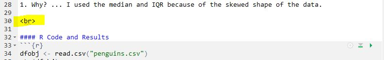

# Getting Data into R {#RData}

R, RStudio, the `NCStats` package, and very basic usage of R were [introduced here](http://derekogle.com/NCMTH107/modules/Prep/RStart.html). This module explains how to enter data into R. Subsequent modules will explain how to use R to create the graphics and compute statistics and test results from these data.

## R Notebooks
Notebooks in RStudio are an efficient way to enter R code, show results of R code, write answers to assignment questions, and compile all of that to a docment that can be handed in.

For class assignments, start by downloading [this template](https://raw.githubusercontent.com/droglenc/NCMTH107/gh-pages/resources/FAQs/R%20Assignment%20Template.Rmd) (right-click, don't change the name) to a folder where you plan to store all of your class-related work. Then open the template in RStudio and change the Author in line 3 to your name. Save the template with this change.

Every time you start an assignment you should open the template file in RStudio and immediately save it (File .. Save As) with a different name (e.g., "Assignment1" ... make sure that the name does not have a "dot" in it). Then edit the Title in line 2 to something that represents the assignment (e.g., "Linear Regression in R"). Do not change anything else in the first 21 lines.

```{r echo=FALSE, out.width='90%'}
knitr::include_graphics("zimgs/Notebook_TopLines.JPG")
```

&nbsp;

### Including Text in the Notebook
#### Creating Sections {-}
Most assignments will have several questions, each of which is identified with a section heading. Your answers to the assignments should be shown under section headings with the same name as on the assignment. Section headings are created by preceding the section heading name with a hashtag. The template has several section headings started that look like this ...

```
# EDIT THIS WITH FIRST SECTION HEADING TEXT
```

You should change this text to create the section heading that you want; e.g., 

```
# Arctic Penguins
```

#### Writing Text for Your Answers {-}
Sentences can be included by typing the text at the beginning of any line. A new paragraph is created by pressing return twice so that there is a blank line between paragraphs.

#### Numbered Lists for Your Answers {-}
A numbered list is created by starting a line with "1. "^[Note the space after the dot and before the text that will form the list item.] followed by what you want after the number (e.g., your answer). If there are no blank lines between consecutive "1. " items then RStudio will automatically iterate the number when the document is compiled. For example, typing this ...

```{r echo=FALSE, out.width='80%'}
knitr::include_graphics("zimgs/Notebook_NumberedList.JPG")
```

... produces the text below ...

&nbsp;

A univariate EDA for penguin body mass is

1. Shape ... right-skewed
1. Outlier ... None
1. Center ... Median of 4050 g
1. Dispersion ... IQR from Q1 of 3550 g to Q3 of 4750 g.
1. Why? ... I used the median and IQR because of the skewed shape of the data.

&nbsp;

#### Symbols and Greek Letters

Greek letters can be produced in your document using special codes as shown below.

* &alpha; comes from `&alpha;`
* &beta; comes from `&beta;`
* &sigma; comes from `&sigma;`
* &mu; comes from `&mu;`
* &ne; comes from `&neq;`
* x&#772; comes from `x&#772;` or x&#x0304; comes from `x&#x0304;`
* p&#770; comes from `p&#770;` or p&#x0302; comes from `x&#x0302;`

You can create subscripts with paired ~ symbols and superscripts with paired ^ symbols; e.g.,

* &sigma;^2^ comes from `&sigma;^2^`
* H~A~: &mu;~1~ &ne; &mu;~2~ comes from `H~A~: &mu;~1~ &ne; &mu;~2~`

::: {.tip data-latex=''}
Please use appropriate symbols in your assignment notebook.
:::

&nbsp;

### Including R Code and Results
Any R code that you use to answer questions should be included in a subsection of R code and results **AFTER** you have answered the questions. You can create a subsection for this code by starting a line with "#### R Code and Results".

All R code is entered into "code chunks" that begin with three backticks followed by curly brackets around "r" (see line 33 below) and end with three backticks (see line 36 below). Between the beginning and ending of the code chunk can be any viable R code. For example,

```{r echo=FALSE, out.width='90%'}
knitr::include_graphics("zimgs/Notebook_Code1.JPG")
```

&nbsp;

In RStudio, each code chunk will have three "icons" in the upper-right portion of the gray chunk (see above). Pressing the right-most icon (right-pointing green arrow) will run the code in the current chunk and show the results immediately below the chunk. For example,

```{r echo=FALSE, out.width='90%'}
knitr::include_graphics("zimgs/Notebook_Code1Run.JPG")
```

&nbsp;

If the code in this chunk depends on code in previous chunks being run then press the middle icon (gray down arrow pointing to a green horizontal line) to run all code in chunks above the current chunk. If the code in previous chunks had already been run then this is unnecessary.

&nbsp;

### Pro Tips
#### Vertical Spacing {-}
If you would like to add some vertical spacing between parts of your notebook (e.g., between sections, between code and paragraphs, etc.) then add a "\<br\>" with a blank line both above and below it where you want the vertical spacing. For example,

```{r echo=FALSE, out.width='90%'}

```

&nbsp;

#### Code Chunk Custom Settings {-}
Code chunks can have a variety of settings. The most important settings can be controlled through the left-most "gear" icon. My most common change here is to change the figure width to be smaller (to 4 inches wide) and, if you want the plot to be square, to change the figure height to the same value. I may also "turn off" the warnings and messages, but I never do this immediately as I would like to see those first before deciding that I should "hide" them. Below shows the gear box for changing the figure width and how the code chunk and result is changed.

```{r echo=FALSE, out.width='90%'}
knitr::include_graphics("zimgs/Notebook_Code2Run.JPG")
```

&nbsp;

### Compile Notebook to MSWord
Once you are comfortable that your R code runs without error and that you have answered all questions for the assignment, then compile your Notebook to a MSWord document. In MSWord you can then save the document to a PDF for handing in via GradeScope.

::: {.tip data-latex=''}
Check your document for completeness and neatness before turning in.
:::

To compile the Notebook to MSWord, select the small arrow on the icon that either says "Preview" or "Knit" and select "Knit to Word". If you get an error related to the name of your Notebook file, then simply select "Knit to Word" a second time. If the document does not produce an MSWord document (this make take several seconds) then there may be an error in your R code.

```{r echo=FALSE, out.width='90%'}
knitr::include_graphics("zimgs/Notebook_KnitWord.JPG")
```

&nbsp;

## Data in R
### Create CSV File
For real data (i.e., several variables from many individuals) it is most efficient to enter data into a comma-separated values (CSV) file and then import that file into R. Creating a CSV file with Microsoft Excel is described below, though there are other ways to create CSV files (see [FAQs on class webpage](http://derekogle.com/NCMTH107/resources/FAQ/)). This explanation assumes that you have a basic understanding of Excel (or other spreadsheet software).

The spreadsheet should be organized with variables in columns and individuals in rows, with the exception that **the first row should contain variable names.** The example spreadsheet below shows the length (cm), weight (kg), and capture location data for a small sample of Black Bears.

```{r echo=FALSE, out.width='30%'}
knitr::include_graphics("zimgs/Data_File_1.jpg")
```

&nbsp;

**Variable names should NOT contain spaces.** For example, don't use "total length" or "length (cm)". If you feel the need to have longer variable names, then separate the parts with a period (e.g., "length.cm") or an underscore (e.g., "length_cm"). **Variable names must also NOT start with numbers or contain "special" characters** such as "~", "!", "&", "@", etc. Furthermore, numerical measurements should NOT include units (e.g., don't use "7 cm"). Finally, for categorical data, make sure that all categories are consistent (e.g., do not have a column that contains both "bayfield" and "Bayfield").

The spreadsheet is saved as a CSV file by selecting the **File..Save As** menu item, which will produce the dialog box below. In this dialog box, change "Save as type" to "CSV (Comma delimited)",^[There are several choices for CSV files here; do NOT choose the one with "UTF-8" in the name.], provide a file name (**do not put any periods in the name**), select a location to save the file (**this should be the same location as your assignment template file**), and press "Save." Two "warning" dialog boxes may then appear -- select "OK" for the first and "YES" for the second. You can now close the spreadsheet file.^[You may be asked to save changes -- you should say "No."]

```{r echo=FALSE, out.width='60%'}
knitr::include_graphics("zimgs/Data_File_2.jpg")
```

&nbsp;

It is important that each row of the data frame correspond to one individual. This is critically important when data are recorded for two different groups (e.g., for a two-sample t-test; see [Module 24](Rttests)). For example, the following data are methyl mercury levels recorded in mussels from two locations labeled as "impacted" and "reference."

```
  impacted   0.011  0.054  0.056  0.095  0.051  0.077
  reference  0.031  0.040  0.029  0.066  0.018  0.042  0.044
```

To follow the "one individual per row" rule, these data are entered in **stacked** format where the "reference" data are stacked underneath the "impacted" data and a column is used to indicate to which group the individuals belong. For example, the Excel file for data entry would look like the following.

```{r echo=FALSE, out.width='25%'}
knitr::include_graphics("zimgs/StackedData.jpg")
```

&nbsp;

Some of the data files that you will use are linked to on the pertinent assignment page (e.g., [this link](https://raw.githubusercontent.com/droglenc/NCData/master/Chirps.csv)). In these cases, the data should be downloaded with the link (right-click, save as) and saved in the same directory or folder as your analysis notebook. The downloaded file is then read into R in the same manner as described above. Note that files provided by me will already be in stacked format and will already be a CSV file.

&nbsp;

### Read CSV File into RStudio
Use `read.csv()` in the first R code chunk of your assignment notebook to load the data from the CSV file into RStudio. The EXACT name of the data file is including within quotes within `read.csv()` and the results should be saved to an object. For example, the code highlighted in yellow in the graphic below was used to read the external "Bears.csv" file into an R object called `dat`. The circled items in the lower-right pane demonstrate that the "Bears.csv" file is in the same directory as the assignment notebooks file.

```{r echo=FALSE, out.width='90%'}

```
```{r echo=FALSE}
bears <- read.csv("data/Bears.csv")
```

One should check the data in this object as described in the [Viewing a Data Frame] section below.

&nbsp;

## Viewing a Data Frame
R may be disorienting at first because you generally cannot "see" your data in the same way that you see it in a spreadsheet program. There are, however, several options for viewing your data. First, you can type the name of the data frame object to see its entire contents.

```{r}
bears
```

Typing the name is adequate for small data.frames, but not useful for large data.frames. The entire data.frame is opened in a separate window by double-clicking on the name of the data.frame in the "Environment" tab of RStudio. Alternatively, you can view a subset of 20 rows of a data frame with `peek()`, the first six rows with `head()`, the last six rows with `tail()`, or the first and last three rows with `headtail()`.

```{r}
peek(bears)
head(bears)
tail(bears)
headtail(bears)
```

&nbsp;

### Structure and Data Types
Data in R will be designated as an `int`eger (whole numbers), `num`eric (non-integer numeric values), `char`acter (strings), `factor` (group membership), or `log`ical (`TRUE`/`FALSE`). Integer and numeric data types correspond to quantitative data. Character and factor data types correspond to categorical data, with the **factor** data type having special characteristics in R that we will exploit for certain analyses. These types of data will be discussed further as needed in other modules.

In addition to viewing the contents of a data object, it is useful to examine the structure of the data frame as returned from `str()`.

```{r}
str(bears)
```

In this example, it is seen that `r kCounts(ncol(bears))` variables were recorded on `r nrow(bears)` individuals. The first variables -- `r names(bears)[1]` -- is numeric, the second -- `r names(bears)[2]` -- is integer, and the last -- `r names(bears)[3]` -- is a character variable. The unique values in a character variable may be seen with `unique()`.

```{r}
unique(bears$loc)
```

A character variable may be converted to a factor variable with `factor()`. In this course, the main reason for doing this would be to control the levels of an ordinal variable because R treats levels alphabetically by default. For example suppose that we wanted to order the levels of the `r names(bears)[3]` variable from west to east (so, Douglas, Bayfield, and Ashland). For this purpose the variable is converted to a factor below with `factor()` and the order of the levels is controlled with `levels=`.

::: {.tip data-latex=''}
Make sure the levels are spelled EXACTLY as they appear in the data.
:::

```{r}
bears$loc <- factor(bears$loc,levels=c("Douglas","Bayfield","Ashland"))
levels(bears$loc)
```

The levels of a factor variable and their order may be seen with `levels()`.

```{r}
levels(bears$loc)
```

&nbsp;

In the previous examples, the `$` notation was used to identify a particular variable (i.e., `loc`) within a data.frame (`bears`). Think of variables as being nested inside data.frames and, thus, to access the variable you must first identify the data.frame in which it exists and then the name of the variable. The `$` simply separates the data.frame from the variable.

```{r}
bears$length.cm
bears$loc
```

&nbsp;

## Vectors
Data.frames are the primary structure in which to store real data. However, much simpler situations that don't require a data.frame may arise. In R, items of the same data type (see [Data Types]) are stored in a one-dimensional **vector**. Vectors are usually displayed in one row (with many columns), but they may also be thought of as a single column (with many rows). Items are entered into a vector with `c()`, where the individual arguments are specific numbers, characters, or logical values.^[`c` comes from "concatenate" or "combine."] Items for a vector of characters must be contained within paired quotes.

```{r}
( v <- c(1,2,5) )
( y <- c("Iowa","Minnesota","Wisconsin") )
```

Single variables from a data.frame are vectors.

```{r}
bears$length.cm
```

Vectors that are not extracted from a data.frame will only be used in this course for very simple lists of items, usually as arguments in a function.

&nbsp;
