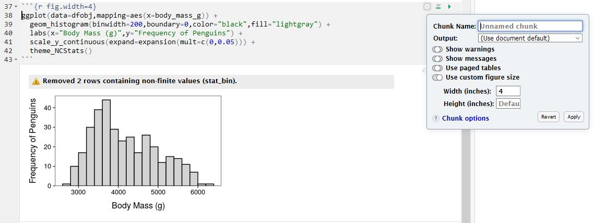
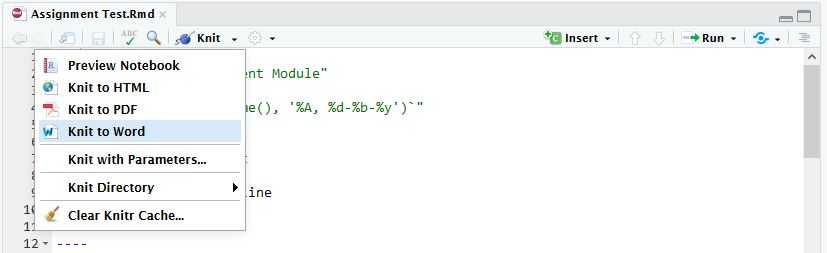

# Getting Organized in RStudio {#RStart}

R, RStudio, the `NCStats`{.inline} package, and very basic usage of R were [introduced here](http://derekogle.com/NCMTH107/modules/Prep/RStart.html). This module explains an efficient method for creating your assignments. Subsequent modules will explain how to get data into R and to use R to create the graphics and compute statistics and test results from these data.

## R Notebooks
Notebooks in RStudio are an efficient way to enter R code, show results of R code, write answers to assignment questions, and compile all of that to a document that can be handed in.

For class assignments, start by downloading [this template](https://raw.githubusercontent.com/droglenc/NCMTH107/gh-pages/resources/FAQs/R%20Assignment%20Template.Rmd) (right-click, don't change the name) to a folder where you plan to store all of your class-related work. Then open the template in RStudio and change the Author in line 3 to your name. Save the template with this change.

Every time you start an assignment you should open the template file in RStudio and immediately save it (File .. Save As) with a different name (e.g., "Assignment1" ... make sure that the name does not have a "dot" in it). Then edit the Title in line 2 to something that represents the assignment (e.g., "Linear Regression in R"). Do not change anything else in the first 21 lines.

```{r echo=FALSE, out.width='90%'}
knitr::include_graphics("zimgs/Notebook_TopLines.JPG")
```

&nbsp;

### Including Text in the Notebook
#### Creating Sections {-}
Most assignments will have several questions, each of which is identified with a section heading. Your answers to the assignments should be shown under section headings with the same name as on the assignment. Section headings are created by preceding the section heading name with a hashtag. The template has several section headings started that look like this ...

```
# EDIT THIS WITH FIRST SECTION HEADING TEXT
```

You should change this text to create the section heading that you want; e.g., 

```
# Arctic Penguins
```

::: {.tip data-latex=''}
Make sure there is a blank line after your section heading line.
:::


#### Writing Text for Your Answers {-}
Sentences can be included by typing the text at the beginning of any line. A new paragraph is created by pressing return twice so that there is a blank line between paragraphs.

#### Numbered Lists for Your Answers {-}
A numbered list is created by starting a line with "1. "^[Note the space after the dot and before the text that will form the list item.] followed by what you want after the number (e.g., your answer). If there are no blank lines between consecutive "1. " items then RStudio will automatically iterate the number when the document is compiled. For example, typing this ...

```{r echo=FALSE, out.width='80%'}
knitr::include_graphics("zimgs/Notebook_NumberedList.JPG")
```

... produces the text below ...

&nbsp;

A univariate EDA for penguin body mass is

1. Shape ... right-skewed
1. Outlier ... None
1. Center ... Median of 4050 g
1. Dispersion ... IQR from Q1 of 3550 g to Q3 of 4750 g.
1. Why? ... I used the median and IQR because of the skewed shape of the data.

::: {.tip data-latex=''}
Make sure there are blank lines before and after your numbered list and make sure there is a space after each of your "1.".
:::

&nbsp;

#### Symbols and Greek Letters

Greek letters can be produced in your document using special codes as shown below.

* &alpha; comes from `&alpha;`
* &beta; comes from `&beta;`
* &sigma; comes from `&sigma;`
* &mu; comes from `&mu;`
* &ne; comes from `&ne;`
* x&#772; comes from `x&#772;` or x&#x0304; comes from `x&#x0304;`
* p&#770; comes from `p&#770;` or p&#x0302; comes from `x&#x0302;`

You can create subscripts with paired ~ symbols and superscripts with paired ^ symbols; e.g.,

* &sigma;^2^ comes from `&sigma;^2^`
* H~A~: &mu;~1~ &ne; &mu;~2~ comes from `H~A~: &mu;~1~ &ne; &mu;~2~`

::: {.tip data-latex=''}
Please use appropriate symbols in your assignment notebook.
:::

&nbsp;

### Including R Code and Results
Any R code that you use to answer questions should be included in a subsection of R code and results **AFTER** you have answered the questions. You can create a subsection for this code by starting a line with "#### R Code and Results".

All R code is entered into "code chunks" that begin with three backticks followed by curly brackets around "r" (see line 33 below) and end with three backticks (see line 36 below). Between the beginning and ending of the code chunk can be any viable R code. For example,

```{r echo=FALSE, out.width='90%'}
knitr::include_graphics("zimgs/Notebook_Code1.JPG")
```

&nbsp;

In RStudio, each code chunk will have three "icons" in the upper-right portion of the gray chunk (see above). Pressing the right-most icon (right-pointing green arrow) will run the code in the current chunk and show the results immediately below the chunk. For example,

```{r echo=FALSE, out.width='90%'}
knitr::include_graphics("zimgs/Notebook_Code1Run.JPG")
```

&nbsp;

If the code in this chunk depends on code in previous chunks being run then press the middle icon (gray down arrow pointing to a green horizontal line) to run all code in chunks above the current chunk. If the code in previous chunks had already been run then this is unnecessary.

&nbsp;

### Pro Tips
#### Vertical Spacing {-}
If you would like to add some vertical spacing between parts of your notebook (e.g., between sections, between code and paragraphs, etc.) then add a "\<br\>" with a blank line both above and below it where you want the vertical spacing. For example,

```{r echo=FALSE, out.width='90%'}
knitr::include_graphics("zimgs/Notebook_UseOfBR.JPG")
```

&nbsp;

#### Code Chunk Custom Settings {-}
Code chunks can have a variety of settings. The most important settings can be controlled through the left-most "gear" icon. My most common change here is to change the figure width to be smaller (to 4 inches wide) and, if you want the plot to be square, to change the figure height to the same value. I may also "turn off" the warnings and messages, but I never do this immediately as I would like to see those first before deciding that I should "hide" them. Below shows the gear box for changing the figure width and how the code chunk and result is changed.

```{r echo=FALSE, out.width='90%'}

```

&nbsp;

### Compile Notebook to MSWord
Once you are comfortable that your R code runs without error and that you have answered all questions for the assignment, then compile your Notebook to a MSWord document. In MSWord you can then save the document to a PDF for handing in via GradeScope.

::: {.tip data-latex=''}
Check your document for completeness and neatness before turning in.
:::

To compile the Notebook to MSWord, select the small arrow on the icon that either says "Preview" or "Knit" and select "Knit to Word". If you get an error related to the name of your Notebook file, then simply select "Knit to Word" a second time. If the document does not produce an MSWord document (this make take several seconds) then there may be an error in your R code.

```{r echo=FALSE, out.width='90%'}

```

&nbsp;
